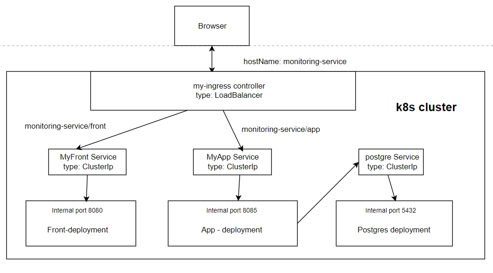

# Monitoring-Service Helm Chart
Helm Chart для развертывания приложения в кластере Kubernetes. Состоит из суб-чартов frontend и backend частей приложения, 
а также базы данных PostgreSql.

---

## Предварительные требования
**Helm**, установленный и настроенный на вашем компьютере. **Kubernetes** кластер, доступный для Helm.

---

## Установка
Все приведенные ниже команды необходимо выполнять из корневой директории проекта.

### Шаг 1: Установка готовых Helm Chart
`helm dependency build chart/`

### Шаг 2: Обновление репозитория
Если каталоги уже скачаны, то необходимо обновить локальные каталоги репозитория Helm, 
чтобы получить последние версии чартов: `helm repo update`

### Шаг 3: Установка chart
Используйте следующую команду для установки чарта, с именем **app**: `helm install app app-chart`

Для установки с пользовательскими настройками из values_custom.yaml 
(values_custom.yaml должен находится в корне проекта): `helm install app app-chart -f values_custom.yaml`

--- 

## Контроль и мониторинг
После установки вы можете использовать следующие команды для управления и мониторинга вашего кластера:

---

### Просмотр состояния подов
Чтобы увидеть состояние подов, используйте команду: `kubectl get pods` или `kubectl get pods --watch`

---

### Просмотр списка служб (services)
Чтобы увидеть список служб (services) в пространстве имен Kubernetes по умолчанию, 
используйте команду: `kubectl get svc`

---

### Логи
Чтобы просмотреть логи пода, используйте команду: `kubectl logs -l <pod-name>`
Просмотреть логи упавшего пода: `kubectl logs -l <pod-name> --previous`

---

### Получить URL для службы (service)
Чтобы получить URL-адрес, по которому можно обращаться службе (service) из 
браузера или других клиентов: `mini[Chart.yaml](..%2Fchart-producer%2FChart.yaml)kube service <service_name> --url`

---

### Обновление чарта новыми конфигурациями
Чтобы обновить чарт, используйте команду: `helm upgrade <chart_name> app-chart`

---

### Обновление чарта измененными зависимыми чартами
Если вы модифицировали зависимые суб-чарты, выполните их обновление командой: `helm dependency update app-chart`

---

### Остановка и удаление
Чтобы остановить и удалить чарт, используйте команду: `helm delete <chart_name>`

---

### Запуск в докере
Для работы в докере при обращении к minikube потребуется объединить контейнеры одной сетью: запуск нашего контейнера: docker build -t helm . docker run --rm --network=minikube helm Запуск с конфигурацией ресурсов: docker run --rm -v "$(pwd)/helm/resources.yaml:/opt/resources.yaml" --network=minikube helm. 
Данную команду выполняем находясь в корневой директории проекта. 

Сертификаты для конфигурационного файла необходимо скопировать с локальных ресурсов в папку miikube.config в корень проекта

